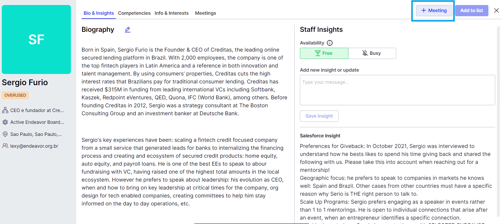

# [Endeavor Connect] Meetings

<aside>
 **O que é uma Meeting?**

Meeting é um registro de uma conexão entre pessoas mentoras e empreendedoras que ocorreu por intermediação da Endeavor. Ela inclui o registro de mentorias, mentorias avaliativas, eventos, mentorias coletivas e outras interações. 

</aside>

<aside>
 **Onde posso criar e editar os campos de uma Meeting?**

A ferramenta principal para gestão de meetings é o Endeavor Connect. Você pode aprender tudo sobre como preencher os campos de uma meetings no Connect aqui: 

</aside>

<aside>
 **Quais dados uma meeting deve ter preenchida?**

Na tabela a seguir você encontra **quais campos uma meeting que você criar** devem ter preenchidos. 

---

[Abas e Campos de Meetings](Abas%20e%20Campos%20de%20Meetings%203697edda39124704909d661d4854cc21.csv)

</aside>

<aside>
 **Quais são e como preencher cada Meeting Type de acordo com o estágio da empresa?**

Empresas da rede podem estar em 3 estágio diferentes (SUP, Seleção ou EE). Para cada estágio, existem diferentes tipo de conexões que precisam seguir algumas regras de preenchimento no Connect: 

</aside>

[Meeting Types](Meeting%20Types%20c3d6995f782749a2b499c8c6ea27137c.csv)

**Em caso de erro/bug**: Enviar uma notificação pelo bot do Slack “Suporte bugs e dúvidas” no canal #Inovação.

Ou nos envie o link da meeting ou Sales Force ID.

<aside>
 **Onde acompanhar os indicadores de Gestão dos Dados?**

Para acompanhar os indicadores relacionados à gestão dos dados (como nível de preenchimento, erros, atualizações e outros), você pode acessar o dashboard:

[https://lookerstudio.google.com/u/0/reporting/0885be92-e583-44f1-bbd9-cbbab9cb1850/page/p_4a25ygvmjd](https://lookerstudio.google.com/u/0/reporting/0885be92-e583-44f1-bbd9-cbbab9cb1850/page/p_4a25ygvmjd)

---

</aside>

Para entender com mais detalhes todos os tipos de “Functional Skills” ou “Challenges”, veja esse material: 

[Renovação das Functional Skills - Global](https://www.notion.so/Renova-o-das-Functional-Skills-Global-3d67f2dd59394e15a2ea91dc4d37a34d?pvs=21)

[Renovação das Functional Skills - Global (1)](https://www.notion.so/Renova-o-das-Functional-Skills-Global-1-15abd9fe4dd680939ee5ddac0168cb96?pvs=21)

[Renovação das Functional Skills - Global (1)](https://www.notion.so/Renova-o-das-Functional-Skills-Global-1-15abd9fe4dd680c696ebeb7c1281f1aa?pvs=21)

### Antigo

<aside>
 **Qual a importância da funcionalidade de meetings e por quê você deveria utilizá-la no Endeavor Connect:**

- Registro dos encontros e de todas as trocas entre a rede **condizentes com a nossa realidade**
- Maior **agilidade** e **velocidade** para o registro das meetings, **liberando tempo** de dedicação nessa atividade
- **Melhor utilização de dados**, de **rastreio** e **registro** das **informações** para **gerar insights** em tomada de decisões
</aside>

<aside>
 **Todas as meetings deverão ser criadas pelo Endeavor Connect e para isso criamos algumas instruções gerais:**

</aside>

- **Criando uma meeting pela Tela de Meetings**
    - Facilitamos os **Stages** e os **Types** para que as meetings reflitam a realidade dos nossos produtos, dessa forma vocês verão que os nomes estão mais intuitivos e fáceis de serem encontrados
    - Reduzimos também **a quantidade de campos que devem ser preenchidos**, tornando o **GC** ainda mais rápido e **diminuindo o tempo que era gasto anteriormente ao registrar uma meeting no SalesForce**
    - Você poderá criar uma meeting em **Potential ou Scheduled sem os Attendees**, esse campo será **obrigatório** apenas quando a meeting tiver em **Completed**
    - **Não há mais necessidade** de preencher a **Application** na meeting, essa lógica funcionará de **forma automática** baseada já nos registros de como os **Attendees (entidade de Contacts)** estão registrados com esses dados no SalesForce. **É importante certificar sempre que os Contacts estarão com os dados atualizados e corretos!**
    - O **Title** da meeting será criado também de **forma automática**, baseado na junção de **Stage** + **Type** + **Subject.** O Subject é uma **versão bem resumida sobre o assunto abordado na meeting** com limitação de no máximo **80 caracteres** (não há necessidade de botar o nome do mentor e da account mais)
    - Ao criar uma meeting nova, os campos de **Status**, **Date**, **Time** e **Duration** serão **pré-preenchidos de forma automática**, mas **você pode fazer a edição** de todos eles para refletir melhor a realidade da sua meeting
- **Quando utilizar os status de Cancelled, No Response e Refused**
    
    Antes de explicar o funcionamento desses três status, queremos reforçar a importância do registro desses dados. Com base nos registros que vocês fizerem poderemos ter uma visibilidade melhor de como está o comportamento da nossa rede mediante os convites que enviamos. 
    
    - **Cancelled**: registro de meetings quando o **founder pediu para cancelar**
    - **No Response:** registro de meetings quando o **mentor não respondeu** ao convite enviado
    - **Refused**: registro de meetings quando o **mentor respondeu** falando que **não tem disponibilidade**
- **Criando uma meeting pelo perfil da pessoa mentora**
    
    Além da Tela de Meeting, se você tiver utilizando a **Tela de Find mentors and entrepreneurs**, ao abrir um **perfil de alguma pessoa mentora**, você poderá criar uma meeting a partir desse perfil. Basta clicar no botão de “**+Meeting**” localizado no lado superior direito, e as informações de Company, Attendees Donated e Neutral virão pré-preenchidas de forma automática.
    
    
    
- **Fazendo a Review da meeting depois de colocar o status de Completed**
    
    Depois que a meeting tiver acontecido, além da atualização do status em colocar essa meeting como Completed é preciso atualizar as informações referentes aos **dois principais desafios** (**Challenges**) que foram abordados nas meetings. Os Challenges são **as listas de Functional Skills** que foram observados na pessoa mentora (**Attendee Donated**). Além disso, você também poderá adicionar os **principais tópicos** que evidenciem os Challenges, que são as **tags**. Por exemplo: o challenge de Scaling Talent: Organization Culture pode ter como tags #okr #recrutamento_e_selecao #diversidade_e_inclusao etc. Lembre-se de colocar também **o link da Meeting Notes**. Nessa parte existe uma **validação do campo e não será permitido adicionar texto**, apenas o link mesmo. 
    
    
    
- **Vídeo demonstrativo com as principais funcionalidades**
    
    O que você vai **ver** e **ouvir** nesse vídeo:
    
    - visão geral do kanban de meetings
    - possibilidade de pesquisar meetings pelo nome da empresa
    - possibilidade de mudar a visualização do histórico das meetings que aparecem
    - criar, editar, deletar e clonar uma meeting
    - fazer a review da meeting
    
    [https://www.loom.com/share/3474ee73c68e43a3a723a4667b2bd0bb?sid=9067db16-f9c7-447b-b2fd-33bd23209774](https://www.loom.com/share/3474ee73c68e43a3a723a4667b2bd0bb?sid=9067db16-f9c7-447b-b2fd-33bd23209774)
    
- **Visão geral de todos os Stages e Types e a relação com o SalesForce**
    
    [Sem título](Sem%20t%C3%ADtulo%20717895f95503459cbdd28fcf321ebe6c.csv)
    
- **Analisando as meetings anteriores que as pessoas mentoras já participaram**
    
    No **perfil das pessoas mentoras** temos a **visualização do histórico de meeting**s. Por **padrão**, iremos ver sempre as **dez meetings mais recentes**, mas você poderá realizar a **busca por palavras que se encontram no título** da meeting e até mesmo **filtrar a ordenação de visualização** das meetings (mais antigas ou mais recentes primeiro).
    
    
    

<aside>
 **FAQ: Ainda tem dúvidas? Veja se a sua pergunta não se encontra em alguma das opções a seguir!**

</aside>

**Se a sua pergunta não estiver aqui entre em contato com a @Nayara Fontes  para ela te auxiliar. Se você tiver dúvidas gerais sobre o Endeavor Connect acesse a [[Endeavor Connect] FAQ](https://www.notion.so/Endeavor-Connect-FAQ-4c470fe51545404a85d596adf9498887?pvs=21)** 

- **As meetings do Endeavor Connect irão aparecer no SalesForce?**
    
    Sim! Os **dois sistemas estão interligados** e qualquer **alteração** que você faça no **Endeavor Connect será refletida no SalesForce e vice-versa.** Dessa forma, não existe a necessidade de utilizar os dois sistemas para registro, basta utilizar o Connect que contém uma praticidade muito maior! 
    
    As **mudanças** feitas dentro do **Endeavor Connect** serão **refletidas praticamente no mesmo instante dentro do SalesForce**, podendo ter um pequeno delay de alguns poucos minutos. Porém as **alterações** feitas no **SalesForce poderão demorar um pouco mais para refletir dentro do Endeavor Connect**. Caso não esteja visualizando algo dentro do Endeavor Connect que tenha feito a edição no SalesForce, aguarde algumas horas ou até o dia seguinte para verificar.
    
- **O meu histórico de meetings do SalesForce irá aparecer no Endeavor Connect?**
    
    Sim! Os dois **sistemas estão interligados** e por mais que você ainda não tenha utilizado a feature de Meetings no Endeavor Connect, você já irá ver no kanban o histórico dos últimos seis meses.
    
- **Por que não consigo adicionar o attendee que quero na meeting?**
    
    As regras para aparecer um **attendee** dentro do Endeavor Connect foram desenhadas baseadas **nas regras de GC que já existem hoje**. Dessa forma, se todos os campos da **entidade Contact** estiverem alinhados conforme ao GC, os dados irão aparecer no Connect. Você pode verificar se tem algum campo que precisa ser corrigido acessando ao dash [**Gestão do Conhecimento - Apuração](https://lookerstudio.google.com/reporting/705b54b8-ee86-4f61-a799-d323c2f9a61e/page/p_96jl7xku4c).** Se todos os campos estiverem corretos e mesmo assim tem algum attendee que não está aparecendo, entre em contato com a @Nayara Fontes para que seja analisado o ocorrido.
    
- **Por que não consigo adicionar a empresa que quero na meeting?**
    
    As regras para aparecer **uma scale-up** dentro do Endeavor Connect foram desenhadas baseadas **nas regras de GC que já existem hoje**. Dessa forma, se todos os campos da **entidade Account** estiverem alinhados conforme ao GC, os dados irão aparecer no Connect. Você pode verificar se tem algum campo que precisa ser corrigido acessando ao dash [**Gestão do Conhecimento - Apuração](https://lookerstudio.google.com/reporting/705b54b8-ee86-4f61-a799-d323c2f9a61e/page/p_96jl7xku4c).** Se todos os campos estiverem corretos e mesmo assim a scale-up não está aparecendo, entre em contato com a @Nayara Fontes para que seja analisado o ocorrido.
    
- **Está faltando um type de meeting que utilizava com frequência.**
    
    Se você sentir falta de qualquer campo ao fazer o registro de uma meeting, entre em contato com a @Nayara Fontes para que seja explorado melhor o cenário de utilização do campo e assim seja feito o ajuste da tela dentro do Endeavor Connect.